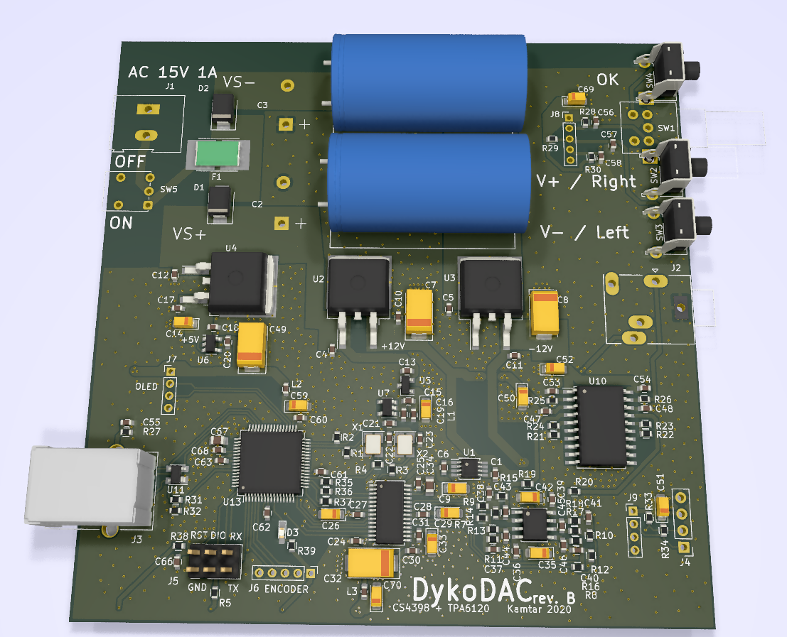
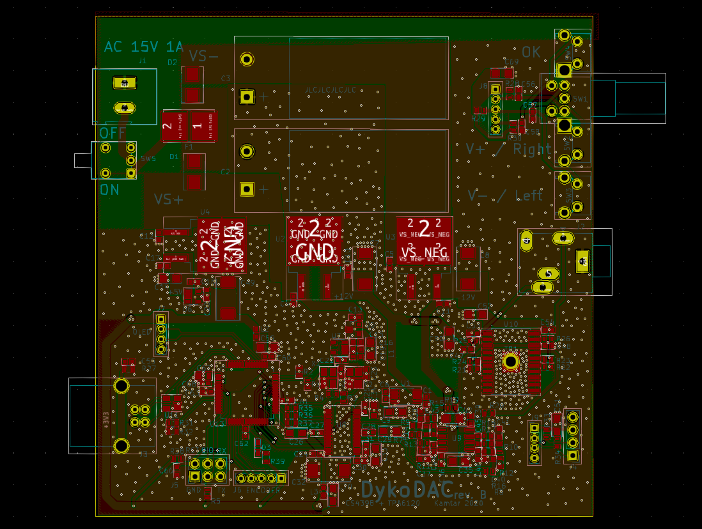

# dykodac
Prototype of USB DAC using <b>CS4398</b>, AD712J and TPA6120A2 as a headphone amplifier. MCU - ATSAMD51 
Designed with 15V/1A transformer in mind, simple and linear power supply.

[Schematics in pdf](./schematics/DykoDAC.pdf)

